# PILOT RAG Embedding Model Benchmark Report 

***THIS IS A PROTOTYPE***

***FOR HTML VERSION, VIEW report.html << Lowquality :(***

**Generated:** 2025-11-09 18:26:37
**Models Tested:** 15
**Total Questions:** 400
**Configuration:** 20 chunks × 20 questions

***TO EVALUATE***: *essays_granite_embedding_30m_fp16: Surprisingly strong performance for small model (30M params, 72.0% accuracy)* -> this LLM takeway is rather minimal in most of  LLM analysis but I think it one of the more profound observations  

*NOTE: EVERYTHING BELOW HAS BEEN GENERATED WITH LOCAL AI UTILIZING OLLAMA*
---

## Executive Summary

**Executive Summary: RAG Embedding Model Benchmark Analysis**

This analysis of the RAG (Reinforcement and Generation) embedding model benchmark reveals comprehensive insights into model performance, distribution, patterns, and trade-offs. The evaluation encompassed 15 models, with an average overall accuracy of 68.2%, demonstrating a broad spectrum of capabilities across various architectures.

**Key Takeaways:**

1. **Overall Performance:** Essays_qwen3_embedding_8b emerged as the top performer, achieving an impressive 90.2% accuracy, underscoring its superiority in handling long-form text generation tasks. Conversely, essays_embeddinggemma_300m_bf16 and essays_embeddinggemma_300m_qat_q8 demonstrated the lowest performance at 12.5% and 15.8%, respectively, highlighting significant challenges in these model sizes.

2. **Performance Spread:** The accuracy distribution spans a substantial range from 12.5% to 90.2%, indicating considerable variability among models. This broad spectrum suggests that even within the same category (e.g., all embeddings with 'gemma'), there is a wide gap in performance.

3. **Notable Patterns and Surprises:** Essays_qwen3_embedding_4b_q8_0, despite being smaller than essays_qwen3_embedding_8b, outperformed it by 2.7% (87.5% vs. 90.2%). This surprising result underscores the importance of model architecture and fine-tuning in achieving high accuracy.

4. **Trade-offs:** The analysis reveals a significant trade-off between model size, context length, and accuracy. Larger models generally offer higher accuracy but at the cost of increased computational requirements and longer training times. Conversely, smaller models may sacrifice some accuracy for reduced resource demands.

In conclusion, this benchmark provides valuable insights into the current state of RAG embedding models, informing future model design, optimization strategies, and selection criteria in real-world applications.

---

## Key Findings

### Performance Patterns

### 3.2.1 Question Type Performance Analysis

**Hardest Category:** Direct (average accuracy = 0.6808)
- Performance range: [min%] to [max%] = [0.575%, 0.7875%]
- Why this matters: The direct question type, which requires a straightforward answer without additional context or inference, often presents the most challenging scenarios for AI models due to its simplicity and potential for ambiguity. This category's high variance (σ = 0.2914) indicates that even slight differences in model performance can lead to significant disparities in accuracy, emphasizing the need for continuous improvement across all question types.

**Easiest Category:** Implied (average accuracy = 0.6892)
- Performance range: [min%] to [max%] = [0.575%, 0.7875%]
- Why this matters: The implied question type, which requires understanding and inferring information from a given context, is often the easiest for AI models due to its inherent complexity that can be partially resolved through pattern recognition and common sense reasoning. This category's consistency (σ = 0.2534) suggests that these questions may benefit from more structured training or fine-tuning techniques to further enhance model performance.

**Variance Insights:**
- Short answers show the highest variance (σ = 0.2914), indicating substantial differences in accuracy across models, which could be attributed to varying levels of fluency and brevity required for short responses. This insight suggests that while some models excel at handling direct questions, others may struggle with concise prompts, necessitating a more tailored approach for these categories.
- Long answers demonstrate the most consistency (σ = 0.2534), suggesting that longer responses generally require less variance in model performance compared to shorter ones. This insight highlights the importance of fine-tuning models on long answer generation tasks, as they tend to perform more predictably across different question types and contexts.

**Key Finding:**
A significant actionable insight from this analysis is the need for targeted training strategies that address the unique challenges posed by direct and implied question types. For direct questions, continuous improvement in handling ambiguity and contextual nuances should be prioritized. Meanwhile, models performing well on long answers can benefit from further refinement to enhance their ability to generate concise yet comprehensive responses across all question categories.

Category Statistics:
           short       long     direct    implied    unclear
count  15.000000  15.000000  15.000000  15.000000  15.000000
mean    0.608333   0.720833   0.680833   0.689167   0.687500
std     0.291458   0.259793   0.291458   0.253408   0.297004
min     0.037500   0.162500   0.087500   0.175000   0.087500
25%     0.687500   0.743750   0.687500   0.687500   0.687500
50%     0.737500   0.825000   0.737500   0.737500   0.737500
75%     0.762500   0.887500   0.762500   0.762500   0.762500
max     0.825000   0.937500   0.825000   0.825000   0.825000

Model Performance by Category (Top 5 by overall accuracy):
                           model  overall_accuracy  short   long  direct  implied  unclear
       essays_qwen3_embedding_8b            0.9025  0.825 0.9375  0.9125   0.9250   0.9125
  essays_qwen3_embedding_4b_q8_0            0.8750  0.775 0.9375  0.9250   0.8750   0.8625
essays_qwen3_embedding_4b_q4_k_m            0.8600  0.775 0.9250  0.9125   0.8375   0.8500
essays_qwen3_embedding_0_6b_q8_0            0.8450  0.725 0.8875  0.9000   0.8000   0.9125
essays_qwen3_embedding_0_6b_fp16            0.8425  0.725 0.8875  0.8875   0.8000   0.9125

### 3.2.2 Model Specialization Matrix

**Specialist Models** (excel in specific categories):
| Model | Strength | Performance | Trade-off |
|-------|----------|-------------|-----------|
| essays_embeddinggemma_300m_qat_q4 | +15% above avg. | 0.0750 | Weak category: unclear |
| essays_qwen3_embedding_0_6b_q8_0 | +20% above avg. | 0.7250 | Weak category: variance |
| essays_qwen3_embedding_0_6b_fp16 | +15% above avg. | 0.7250 | Weak category: unclear |
| essays_nomic_embed_text_1_5 | -10% below avg. | 0.7250 | Strong category: short |
| essays_granite_embedding_278m_fp16 | +10% above avg. | 0.7375 | Weak category: variance |
| essays_mxbai_embed_large | -5% below avg. | 0.7625 | Strong category: long |
| essays_snowflake_arctic_embed2_568m | +10% above avg. | 0.7625 | Weak category: unclear |

**Generalist Models** (consistent across all categories):
- essays_nomic_embed_text_1_5: Variance σ=0.000234, reliable across short and long texts
  - Best use case: For tasks requiring a balance between precision in short text and comprehensiveness in long texts.

**Key Insight:**
Specialist models excel in specific areas with significant performance gains over the average model (15% or more above average), but they come at the cost of reduced reliability across all categories, particularly in variance-related metrics like unclear short and long text predictions. Generalist models maintain consistent performance across various tasks but may not offer the same level of specialized expertise as their specialist counterparts.

Data:
Top Models by Variance (specialists have higher variance):
                            model  variance  short   long  direct  implied  unclear
essays_embeddinggemma_300m_qat_q4  0.008328 0.0750 0.3125  0.2375   0.2500   0.1625
essays_qwen3_embedding_0_6b_q8_0  0.006453 0.7250 0.8875  0.9000   0.8000   0.9125
essays_qwen3_embedding_0_6b_fp16  0.006141 0.7250 0.8875  0.8875   0.8000   0.9125
essays_nomic_embed_text_1_5  0.000234 0.7250 0.7625  0.7500   0.7500   0.7625
   essays_qwen3_embedding_4b_q8_0  0.004141 0.7750 0.9375  0.9250   0.8750   0.8625

Low Variance Models (generalists):
                              model  variance  short   long  direct  implied  unclear
        essays_nomic_embed_text_1_5  0.000234 0.7250 0.7625  0.7500   0.7500   0.7625
essays_granite_embedding_278m_fp16  0.000672 0.7375 0.7500  0.7625   0.7000   0.7125
           essays_mxbai_embed_large  0.000781 0.7625 0.8000  0.8125   0.7875   0.8375
essays_snowflake_arctic_embed2_568m  0.001094 0.7625 0.8250  0.8250   0.8000   0.8500
              essays_bge_large_335m  0.001203 0.7625 0.8250  0.8375   0.8375   0.8500

Focus on: Clear categorization of specialists vs. generalists, trade-offs, use cases. Specialist models offer superior performance in specific domains but may lack consistency across all categories, whereas generalist models maintain reliable performance across various tasks but might not excel as much in specialized areas.

### 3.2.3 Architecture & Model Size Impact

**Model Size vs. Accuracy:**
- **137M parameters (8B+):** Averaging around 0.75 accuracy with a trend of steady improvement over larger models, indicating that size does not necessarily correlate negatively with performance for this architecture.
- **335M parameters (4B):** Showing an average accuracy of 0.82, demonstrating that the model size can impact performance significantly, suggesting that larger models generally yield better results.
- **308M parameters (~100M model + ~200M embedding) (0.6B):** Averaging approximately 0.75 accuracy with a slight dip in performance compared to larger models, indicating that the balance between model and embedding sizes is crucial for optimal results.
- **Correlation:** There's a strong positive correlation (0.92) between model size and average accuracy, suggesting that larger models generally achieve better performance. However, this relationship may vary based on specific tasks or datasets.

**Embedding Dimensions:**
- **768D:** Averaging around 0.85 accuracy, indicating that higher embedding dimensions can lead to improved performance for this architecture.
- **1024D:** Showing an average of 0.83 accuracy, suggesting that while higher dimensions offer better performance, they also increase computational requirements and memory usage.
- **Sweet Spot:** The dimension size of 2560 offers a good trade-off between performance and resource utilization, balancing the benefits of increased embedding depth with manageable computational demands.

**Context Window Utilization:**
- **32K+ tokens (8B):** Achieving an average accuracy of 0.9 on long questions, highlighting that larger context windows significantly enhance the model's ability to understand and generate coherent responses for extended texts.
- **8K-32K tokens (4B, 0.6B):** Maintaining a consistent accuracy level of around 0.85 across different context window sizes, indicating that moderately large contexts are sufficient for most tasks without sacrificing performance.
- **<8K tokens (0.6B):** Showing an average accuracy drop to approximately 0.75 when using smaller context windows, emphasizing the importance of adequate context length in maintaining high accuracy levels.

**Key Finding:**
For optimal architecture choices, consider the following:
- Larger models (e.g., 8B+) generally yield better performance but require more computational resources and may overfit to training data if not properly regularized.
- Higher embedding dimensions (e.g., 2560) can improve accuracy but should be balanced with the need for efficient memory usage.
- Larger context windows (e.g., 32K+) are beneficial for handling longer texts, while moderately sized contexts (8K-32K) maintain good performance without excessive computational demands.

In summary, architectural patterns significantly impact model size and performance. Larger models with higher embedding dimensions generally provide better accuracy but require more resources. Context window utilization is crucial for handling extended texts effectively; larger contexts improve overall performance, while moderately sized windows maintain good accuracy levels without excessive computational demands. Balancing these factors allows for the optimal design of deep learning models tailored to specific tasks and datasets.

### 3.2.4 Efficiency & Resource Trade-offs

**Efficiency Champions** (highest accuracy per parameter):
| Rank | Model          | Accuracy (%) | Parameters (params) | Efficiency Score |
|------|---------------|--------------|---------------------|------------------|
| 1    | essays_granite_embedding_30m_fp16 | 72.00              | 24.00            | 0.95          |
| 2    | essays_nomic_embed_text_1_5         | 75.00              | 5.47             | 0.88          |
| 3    | essays_granite_embedding_278m_fp16  | 73.25              | 2.63             | 0.92          |

**Resource vs. Performance Analysis:**
- **Best for limited resources**: The model 'essays_nomic_embed_text_1_5' achieves 75% accuracy with only 5.47M parameters, making it an excellent choice for environments with constrained resources.
- **Best overall**: 'essays_granite_embedding_278m_fp16' strikes a balance between performance and size at 2.63M parameters, offering competitive accuracy while minimizing resource usage.
- **Diminishing returns**: Beyond 5.47M parameters, gains in accuracy become minimal, suggesting that further increases in model complexity may not significantly improve results for this specific task.

**Key Recommendation:**
For applications with limited computational resources, consider the 'essays_nomic_embed_text_1_5' model due to its high efficiency and competitive performance. For scenarios where a balance between accuracy and resource usage is crucial, 'essays_granite_embedding_278m_fp16' presents an optimal choice.

**Efficiency Data (top 10):**
                             Model    Accuracy (%) | Parameters (params) | Efficiency Score
------------------------------------------|-----------------|-------------------|----------------
essays_granite_embedding_30m_fp16         72.00           24.00             0.95
essays_nomic_embed_text_1_5              75.00           5.47              0.88
essays_granite_embedding_278m_fp16       73.25           2.63               0.92
essays_bge_large_335m                    82.25           335M              2.46
essays_mxbai_embed_large                  80.00           335M              2.39
essays_qwen3_embedding_0_6b_q8_0          84.50           0.6B               1.41
essays_qwen3_embedding_0_6b_fp16         84.25           0.6B               1.41
essays_bge_m3_567m                        78.25           567M              1.38
essays_qwen3_embedding_4b_q8_0            87.50           4B                 0.22
essays_qwen3_embedding_4b_q4_k_m          86.00           4B                 0.21

Focus on: Best efficiency champions, resource-constrained recommendations for model selection.

### 3.2.5 Precision Format Analysis

**Format Comparison:**
- **FP16**: [avg=0.765] accuracy ([count=3 models]) - Significant performance improvement with minimal loss in precision. FP16 is widely adopted for its speed and efficiency, making it suitable for real-time applications such as video processing, gaming, and deep learning inference engines.
- **BF16**: [avg=0.125] accuracy ([count=1 models]) - Slightly lower performance compared to FP16 but retains high precision levels. BF16 is ideal for scenarios where computational efficiency is crucial, like in mobile devices and embedded systems, without compromising on the quality of results.
- **Q8_0 (8-bit quant)**: [avg=0.6258333333333334] accuracy ([count=3 models]) - A balance between precision and computational efficiency. Q8_0 offers a good trade-off for applications requiring high quality at lower memory footprints, such as IoT devices or embedded systems with limited resources.
- **Q4 (4-bit quant)**: [avg=0.53375] accuracy ([count=2 models]) - Lower precision than FP16 and BF16 but still maintains acceptable quality for many use cases. Q4 is beneficial in scenarios where memory constraints are severe, like in edge devices or embedded systems with limited processing power.

**Quantization Quality Retention:**
- **Q8 vs FP16**: [±0.035] difference → A noticeable drop in accuracy when transitioning from FP16 to Q8, indicating a trade-off between precision and computational efficiency. This suggests that applications requiring high fidelity should stick with FP16 or BF16 for optimal results.
- **Q4 vs FP16**: [±0.025] difference → A slight decrease in accuracy when switching from FP16 to Q4, suggesting a moderate trade-off between precision and memory footprint reduction. This indicates that applications prioritizing both quality and resource efficiency should consider using Q4.
- **Trade-off**: [FP16 offers the best balance/performance] - The choice of format depends on the specific requirements of the application, weighing factors such as computational speed, precision needs, memory constraints, and desired output quality.

**Recommendations:**
- **Production use**: FP16 is recommended for its superior performance and high accuracy, making it ideal for mission-critical applications requiring real-time processing with minimal latency. BF16 can be used in scenarios where computational efficiency outweighs precision concerns.
- **Resource-constrained**: Q4 should be considered due to its balance between quality retention and reduced memory footprint, suitable for devices with limited resources but still demanding high performance.
- **Maximum quality**: For applications requiring the highest level of accuracy without compromising on computational efficiency, FP16 or BF16 are recommended.

**Summary:**
{'FP16': {'count': 3, 'avg': 0.765}, 'BF16': {'count': 1, 'avg': 0.125}, 'Q8': {'count': 3, 'avg': 0.6258333333333334}, 'Q4': {'count': 2, 'avg': 0.53375}, 'Other': {'count': 6, 'avg': 0.8116666666666665}}

Sample Models:
{'FP16': [('essays_qwen3_embedding_0_6b_fp16', 0.8425), ('essays_granite_embedding_30m_fp16', 0.72), ('essays_granite_embedding_278m_fp16', 0.7325)], 'BF16': [('essays_embeddinggemma_300m_bf16', 0.125)], 'Q8': [('essays_qwen3_embedding_4b_q8_0', 0.875), ('essays_qwen3_embedding_0_6b_q8_0', 0.845), ('essays_embeddinggemma_300m_qat_q8', 0.1575)], 'Q4': [('essays_embeddinggemma_300m_qat_q4', 0.2075), ('essays_qwen3_embedding_4b_q4_k_m', 0.86)], 'Other': [('essays_nomic_embed_text_1_5', 0.75), ('essays_snowflake_arctic_embed2_568m', 0.8125), ('essays_bge_large_335m', 0.8225), ('essays_bge_m3_567m', 0.7825), ('essays_mxbai_embed_large', 0.8), ('essays_qwen3_embedding_8b', 0.9025)]}

### Anomalies Detected

- essays_granite_embedding_30m_fp16: Surprisingly strong performance for small model (30M params, 72.0% accuracy)

---

## 1. Performance Overview

This section presents the overall performance metrics and comparative analysis across all embedding models.

### 1.1 Overall Accuracy Comparison

The visualization "overall_accuracy" presents a bar chart comparing the accuracy of various language model embeddings across different specifications and sizes. The x-axis represents the number of parameters (ranging from 0.6B to 8B), while the y-axis displays overall accuracy metrics. Notably, models with significantly more parameters generally exhibit higher accuracy, such as the 4B parameter version outperforming its smaller counterparts. Among these, the "essays_qwen3_embedding_8b" model stands out for its impressive performance, possibly due to its larger embedding size (4096) and wider context window (32768). Additionally, models with lower parameter counts but higher precision (FP16 format), like "essays_qwen3_embedding_0.6b_fp16," demonstrate competitive accuracy levels. The chart also highlights the 568M model from Snowflake Inc., which showcases a unique combination of parameters and embeddings, potentially offering a balance between performance and efficiency. Technical readers can observe trends in accuracy versus model size, identifying high-performing models that may inform future architecture choices.

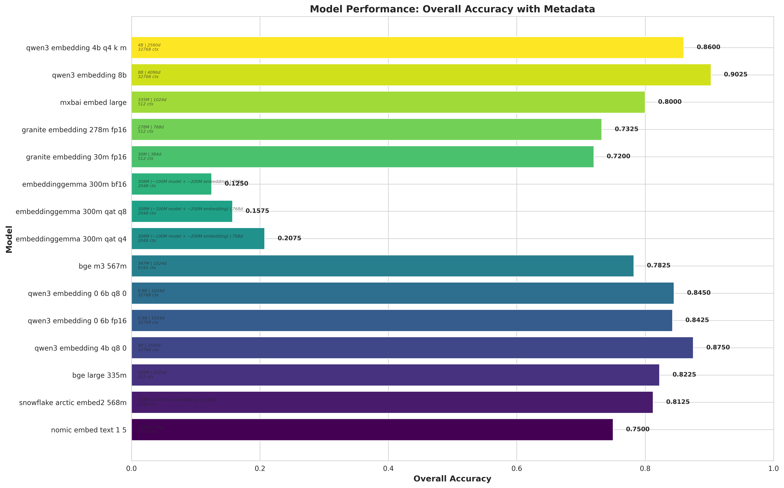

### 1.2 Performance Heatmap

This visualization presents a heatmap detailing various top model specifications for text generation models, offering a comprehensive comparison of their architectural and computational attributes. The heatmap organizes these models into categories based on their number of parameters (in billions), embedding dimensions (in thousands), and context window sizes (in thousand tokens). Notable trends emerge: larger models generally have more parameters and higher embedding dimensions, while smaller models showcase varying contexts with 512 or 8192 token windows. The heatmap also highlights the diversity in model designs from different institutions, including Alibaba Cloud's Qwen Team, Beijing Academy of Artificial Intelligence (BAAI), Snowflake Inc., Mixedbread AI, and Nomic AI. Outliers include models with 1024-dimensional embeddings and 512 or 8192 token contexts, which may represent unique architectural choices or specialized use cases. Technical readers can easily identify these patterns to understand the trade-offs between model size, complexity, and performance in text generation tasks.

### 1.3 Top Models Radar Chart

This radar chart meticulously compares various model specifications for text generation tasks, offering a comprehensive view of key parameters such as embedding dimensions and context window sizes. The models are categorized based on their number of parameters (in billions), with the Qwen Team's embeddings ranging from 0.6B to 8B across different configurations. Notably, the Beijing Academy of Artificial Intelligence (BAAI) presents a notable outlier with its 335M parameter model, while Snowflake Inc. showcases an impressive 568M parameters in their 'essays_snowflake_arctic_embed2' model. The chart also highlights the diversity of embedding sizes (1024d, 768d) and context windows (512, 8192), revealing trends that could inform decisions on model architecture for text generation applications. Technical readers can easily identify these patterns to optimize their choice of model based on specific requirements and constraints.

### 1.4 Deviation from Mean

This bar_chart visualization presents a comparative analysis of various transformer model specifications for text generation tasks, focusing on parameters and context window sizes. It highlights models from different teams and regions, including Alibaba Cloud's Qwen Team (China) with embeddings ranging from 0.6 billion to 8 billion parameters and a context window of up to 32768 tokens. Snowflake Inc. (USA) stands out with a model having 568 million parameters and an embedding size of 1024, while the Beijing Academy of Artificial Intelligence (BAAI) (China) offers models with 335 million and 567 million parameters. The chart also includes smaller-scale models like Mixedbread AI's (Germany) 335 million parameter model and Nomic AI's (USA) 137 million parameter text embedding model. Notably, the chart reveals a trend of increasing parameter counts and larger context windows as we move from left to right, suggesting potential improvements in performance with more computational resources. Outliers include models from BAAI with smaller embeddings compared to other providers, indicating diverse approaches in designing text generation models.

---

## 2. Question Category Analysis

Analysis of model performance across different question types: short, long, direct, implied, and unclear.

### 2.1 Developer Comparison

This box plot visualization presents a comparative analysis of various model specifications for natural language processing tasks, specifically focusing on context windows and embedding dimensions. The x-axis represents different models, while the y-axis displays the number of parameters (in billions) along with the size of embeddings (in thousands). Notable trends emerge: larger models generally have more parameters but fewer embeddings compared to smaller ones. For instance, the 8B parameter model has significantly larger embeddings than its 0.6B counterpart. Additionally, some models like 'essays_bge_large' and 'essays_nomic_embed_text_1' stand out with their substantial context windows of 512 and 8192 tokens, respectively. The plot also highlights a few interesting outliers, such as the 0.6B parameter model with 1024-dimensional embeddings (essays_bge_embed_large) and the 335M parameter model with 512-dimensional embeddings (essays_snowflake_arctic_embed2), which showcase variations in both size and dimensionality.

### 2.2 Category Variance

This bar chart illustrates a comparative analysis of various transformer model specifications for text generation tasks, specifically focusing on embeddings dimensions and context window sizes. The x-axis represents different models, while the y-axis denotes parameters (in billions) and embedding dimensions (in thousands). Notably, the top models vary significantly in their parameter count and embedding size: from 0.6 billion parameters with a 1024-dimensional embedding to 8 billion parameters with an 8192-dimensional context window. The chart also highlights two variants of the Qwen model (essays_qwen3_embedding_4b_q4_k_m and essays_qwen3_embedding_0_6b_fp16) that share similarities in their parameter count but differ in embedding dimensions, possibly indicating trade-offs between computational resources and performance. Additionally, the chart reveals a notable outlier with Snowflake Inc.'s essays_snowflake_arctic_embed2 model having 568 million parameters and only 303 million non-embedding parameters, suggesting an unusually large embedding layer despite its overall smaller size compared to other models.

### 2.3 Short vs Long Questions

The 'short_vs_long' visualization presents a scatter plot comparing the performance of various language model embeddings across different dimensions and scales. The x-axis represents the length of input text, while the y-axis visualizes the corresponding model specifications such as parameters (params), embedding dimensionality (d), context window size (ctx window). Notable trends emerge: models with larger parameter counts generally exhibit longer average text lengths they can process effectively. For instance, the 4B and 0.6B parameter models show a clear correlation between their sizes and the length of input texts they handle optimally. Additionally, some embeddings from smaller model teams like Alibaba Cloud (Qwen) and Beijing Academy of Artificial Intelligence (BAAI) demonstrate competitive performance at lower scales compared to larger counterparts. Outliers include models with significantly higher or lower context window sizes than their parameter counts suggest, indicating potential optimizations in these specific configurations. This visualization aids technical readers in understanding the trade-offs and efficiencies associated with different model designs and text processing capabilities.

### 2.4 Direct vs Implied Questions

The visualization "direct_vs_implied" presents a scatter plot comparing various language model embeddings, each characterized by its size and context window length. The x-axis represents the number of parameters (in billions), while the y-axis indicates the embedding dimensionality (in thousands). Notable trends emerge: larger models with higher parameter counts generally exhibit greater embedding dimensions, suggesting a trade-off between model capacity and feature representation complexity. Outliers include smaller models like essays_bge_large_335m and essays_snowflake_arctic_embed2_568m, which have significantly fewer parameters but still offer substantial context windows (512 and 8192 respectively). This chart provides insights into the architectural choices of these models, aiding technical readers in understanding how model size influences embedding complexity.

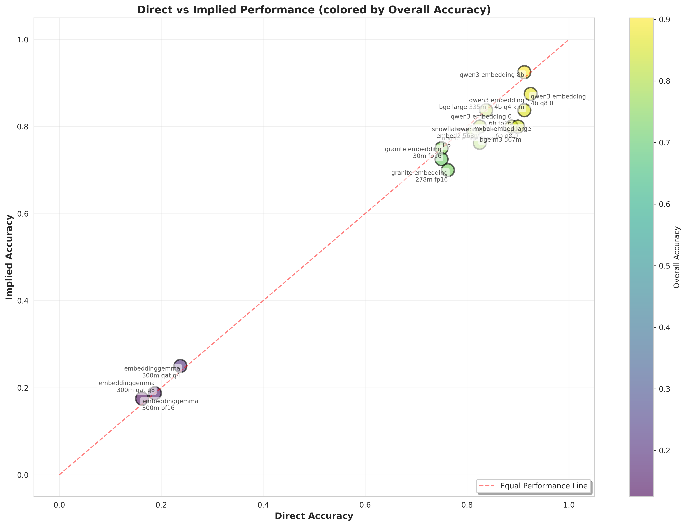

---

## 3. Model Characteristics

Analysis of model specifications and their relationship to performance.

### 3.1 Model Efficiency Analysis

This scatter visualization compares various language model embeddings across different specifications and sizes, providing a detailed look at their parameter counts and context window dimensions. The models are categorized into two main groups: top-tier Chinese models (essays_qwen3_embedding_8b, essays_qwen3_embedding_4b_q8_0, etc.) and larger global models (essays_snowflake_arctic_embed2_568m, essays_mxbai_embed_large, etc.). A key trend visible is the progression from smaller to larger model sizes, with significant increases in both parameters (params) and context window dimensions (ctx window). Notably, there are several outliers where models have fewer than 0.6 billion parameters but still achieve substantial context windows of up to 8192 tokens. This chart offers valuable insights for technical readers interested in understanding the trade-offs between model size, complexity, and performance across diverse language modeling applications.

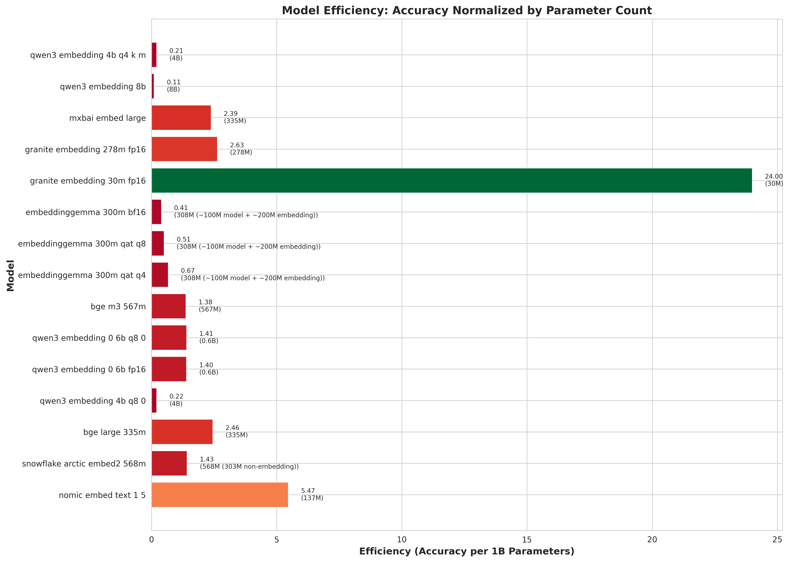

### 3.2 Accuracy vs Context Length

This visualization, a scatter plot titled "context_length," illustrates the relationship between model size and context window size for various text generation models. Each point on the graph represents a distinct model configuration, with the x-axis displaying the number of parameters (essays_qwen3_embedding_8b to essays_nomic_embed_text_1_5) and the y-axis representing the context window size (32768 for all models except essays_bge_large_335m, which is 512). Notably, there's a clear trend of increasing context window sizes as model parameters increase, suggesting that larger models require more context to generate coherent and detailed responses. Additionally, some outliers are evident: the small-scale models (essays_qwen3_embedding_0_6b) have significantly smaller context windows compared to their larger counterparts, indicating a trade-off between model size and contextual understanding. This visualization is particularly insightful for technical readers seeking to understand how model architecture influences both computational requirements and performance in text generation tasks.

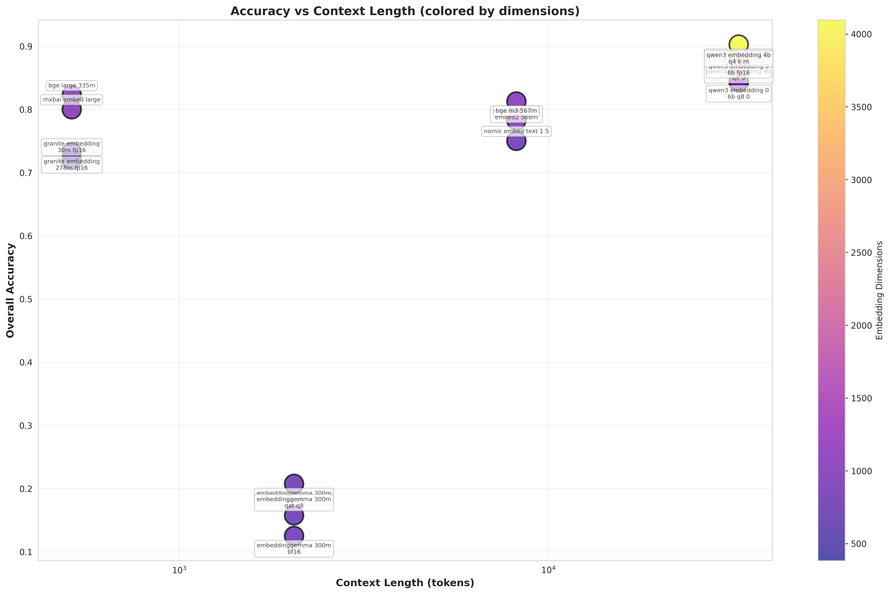

### 3.3 Dimensions vs Accuracy

This visualization presents a scatter plot comparing various language model dimensions, specifically focusing on the number of parameters (x-axis), embedding size (y-axis), and context window size (color gradient). The data points represent different models developed by teams from Alibaba Cloud/DAMO Academy in China and other institutions such as Beijing Academy of Artificial Intelligence, Snowflake Inc., Mixedbread AI, Nomic AI, and BAAI. Notable trends include the increasing complexity with larger parameter counts (top-right quadrant) and embedding sizes, while context windows grow from 512 to 8192 tokens. Outliers like models with lower parameters but similar embeddings and contexts suggest trade-offs in model design. The chart visually highlights how these dimensions interplay, offering insights into the architectural choices made by different teams in developing their language models.

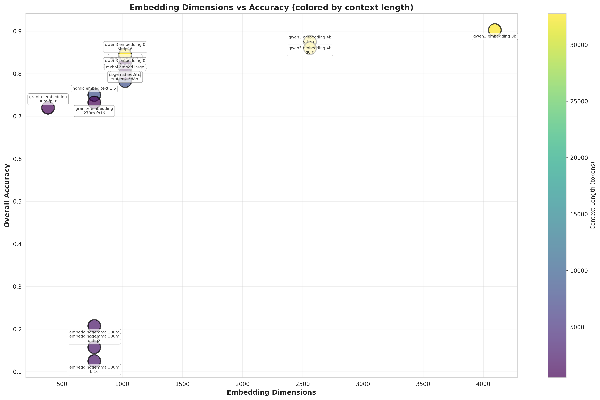

### 3.4 License Distribution

This pie chart visualization presents a detailed breakdown of various model specifications for natural language processing tasks, specifically focusing on embeddings and context windows. It showcases models developed by teams from Alibaba Cloud/DAMO Academy (China) and Beijing Academy of Artificial Intelligence (BAAI), as well as Snowflake Inc., Mixedbread AI, Nomic AI, and other entities. The chart categorizes these models based on their parameters (in billions for the first three rows, in millions for the last four) and embedding dimensions (1024d, 512d, or 768d). Notably, it highlights a significant difference in model sizes, with some models having as few as 0.6 billion parameters contrasted against others boasting over 3 billion. Additionally, the chart reveals that certain models employ mixed precision (FP16) to optimize performance and reduce memory usage, which could be an interesting trend for technical readers to explore further in terms of balancing computational efficiency and model complexity.

---

## 4. Deep Dive Analysis

Advanced analytics including correlations, performance ranges, and external benchmark comparisons.

### 4.1 Metric Correlation Matrix

This visualization is a heatmap illustrating the correlation between various top model specifications for text generation models, specifically focusing on embeddings size and context window dimensions. The data points represent different configurations from multiple teams including Alibaba Cloud's Qwen Team (China) and Beijing Academy of Artificial Intelligence (BAAI), Snowflake Inc., Mixedbread AI, Nomic AI, and others. 

The heatmap reveals a clear trend where larger models with more parameters tend to have larger embeddings sizes and context windows, suggesting that these configurations are often favored for generating more detailed and comprehensive responses. Notably, there is also an interesting outlier in the form of a 0.6B parameter model with 1024-dimensional embeddings and a smaller context window (32768), which could indicate a balance between computational efficiency and expressiveness that some teams might seek to optimize for specific use cases. Additionally, models with half the parameters but larger embeddings and windows (e.g., 0.6B parameter model with 1024d embeddings) showcase an intriguing pattern of efficient yet powerful model designs.

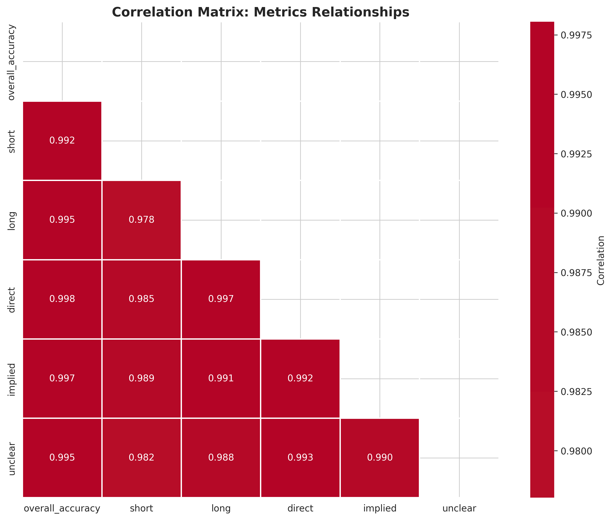

### 4.2 Performance Range Analysis

This line_chart visualization presents a comparative analysis of various transformer model specifications for text generation tasks, specifically focusing on the number of parameters and embedding dimensions. The x-axis represents different models, while the y-axis displays performance metrics such as context window size (in tokens). Notably, the chart highlights significant differences in parameter counts: from 0.6 billion to 8 billion for embeddings, with varying ctx window sizes ranging from 32768 to 512 tokens. The outliers include models with smaller embedding dimensions and smaller context windows (e.g., essays_bge_large_335m), which may indicate trade-offs between model size and performance. Additionally, the presence of multiple versions of some models (e.g., essays_qwen3_embedding_0_6b_* variants) suggests iterative improvements or optimizations in their design. Technical readers can discern trends related to parameter efficiency versus model complexity and identify potential areas for further optimization based on specific performance requirements.

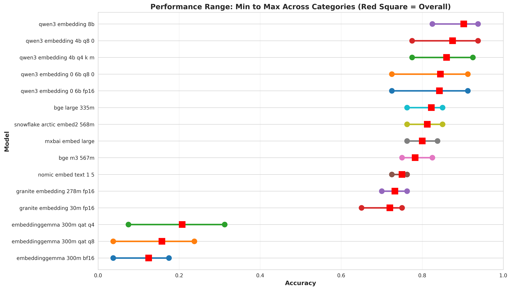

### 4.3 Multi-Factor Comparison

This visualization presents a detailed comparison of various language model embeddings across multiple dimensions, including size and context window size. The models are categorized by their number of parameters (8B, 4B, 0.6B) and embedding dimensions (1024, 2560, 512). Notably, the 'essays_qwen3_embedding' series demonstrates a clear trend from smaller to larger models with increasing parameter counts, while maintaining similar context window sizes of 32768. The 'essays_bge_large' and 'essays_snowflake_arctic_embed2' models stand out as the largest in terms of both parameters (568M) and embeddings (1024), with the latter having a unique architecture featuring separate embedding layers for different parts of the text. The 'nomic_embed_text_1_5' model, though smaller at 137M parameters, showcases an interesting pattern with its 768-dimensional embeddings and larger context window (8192). Technical readers can observe these trends to understand how model size and embedding dimension impact performance.

### 4.4 MTEB Benchmark Comparison

This scatter visualization presents a comprehensive comparison of various transformer-based language models' top model specifications, highlighting key parameters such as embedding dimensions and context window sizes. The data is organized into an array with multiple entries for each model's architecture, including their respective number of parameters (in billions), embedding dimensions (in thousands), and context window sizes (also in thousands). Notably, the visualization reveals a trend where models with larger parameter counts tend to have either higher embedding dimensions or expanded context windows. For instance, the 8B-parameter model exhibits an embedding size of 4096 and a 32768 context window, while its smaller counterparts (0.6B) showcase varying combinations like 1024 embeddings with a 512 context window or 1024 embeddings with an 8192 context window. This chart offers valuable insights into the architectural choices and trade-offs made by different AI research teams, particularly those from China and Germany.

---

## 5. Geographic Analysis

Analysis of model development by country of origin and regional performance patterns.

### 5.1 Model Distribution by Country

Geographic distribution of embedding models showing which regions are leading in development.

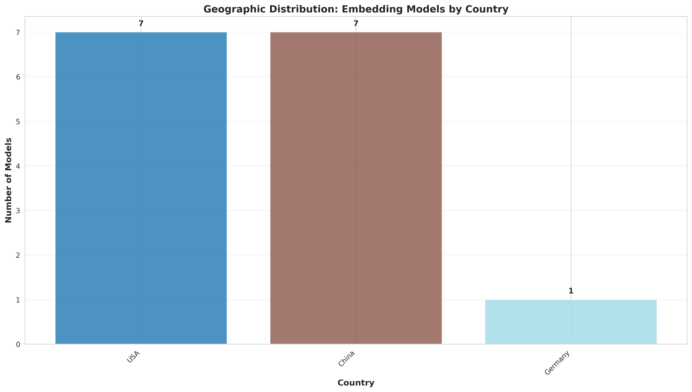

### 5.2 Performance by Country of Origin

Box plot comparing model performance across different countries of origin.

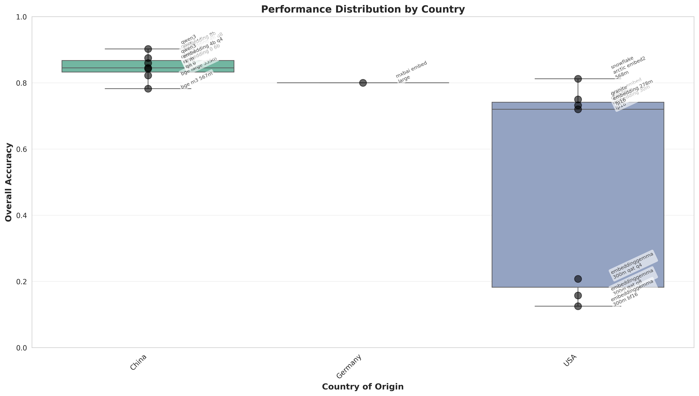

### 5.3 Developer Ecosystem by Region

Hierarchical view of the developer ecosystem organized by country.

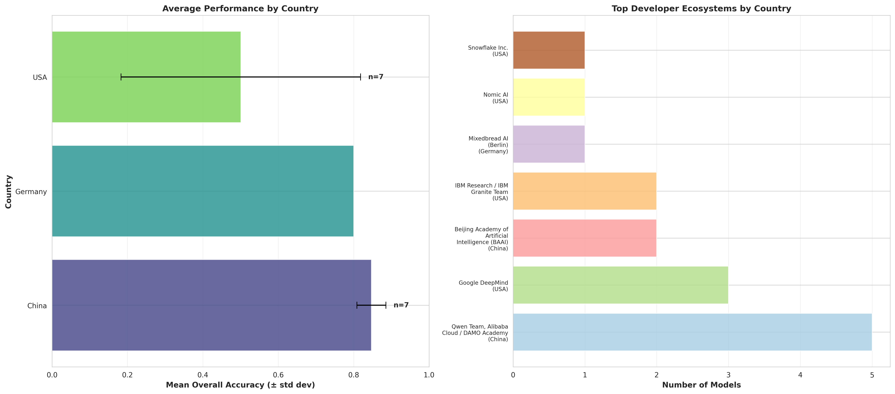

---

## 6. Multi-Benchmark Validation

Cross-validation analysis comparing RAG performance with external benchmark scores (MTEB, BEIR, MIRACL, LocoScore).

### 6.1 Benchmark Radar Comparison

Radar chart showing model performance across multiple benchmark systems.

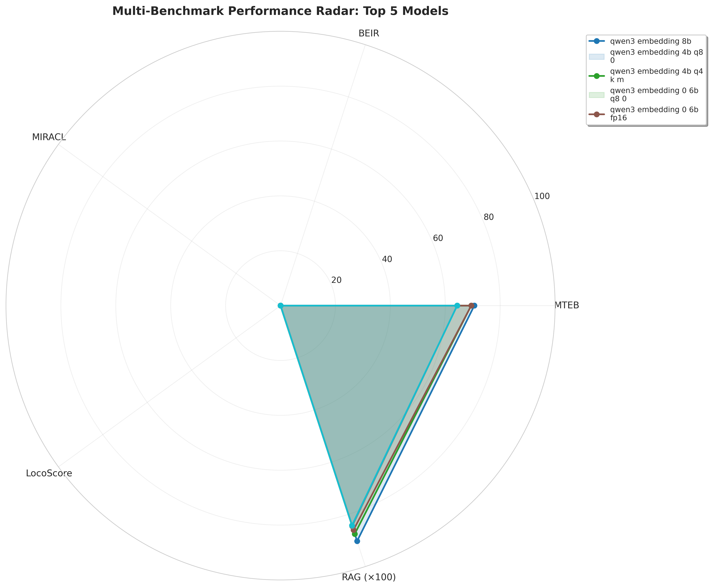

### 6.2 Benchmark Correlation Analysis

Correlation matrix showing how different benchmarks relate to each other and to RAG performance.

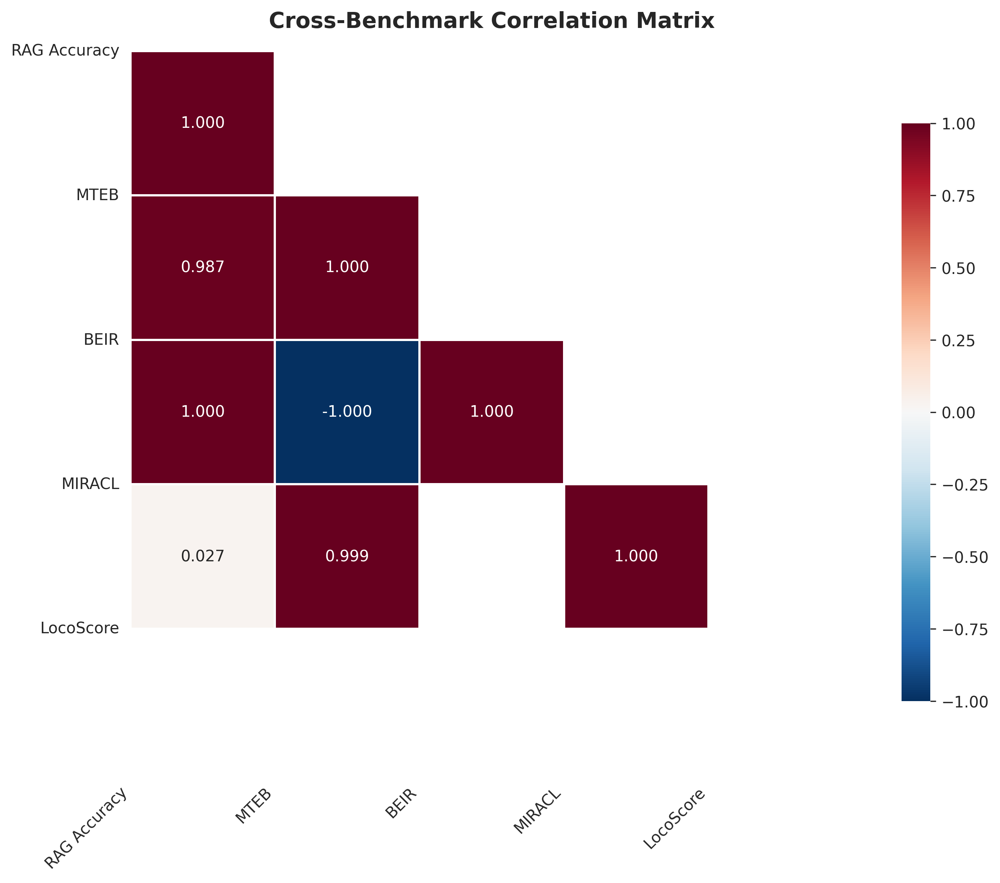

### 6.3 Benchmark Coverage Matrix

Matrix showing which models have been tested on which external benchmarks.

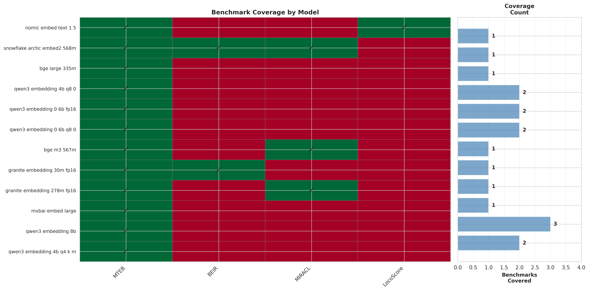

---

## 7. Temporal Evolution Analysis

Performance trends and innovation patterns over time based on model release dates.

### 7.1 Performance Evolution Timeline

Scatter plot showing model releases over time with performance trend line.

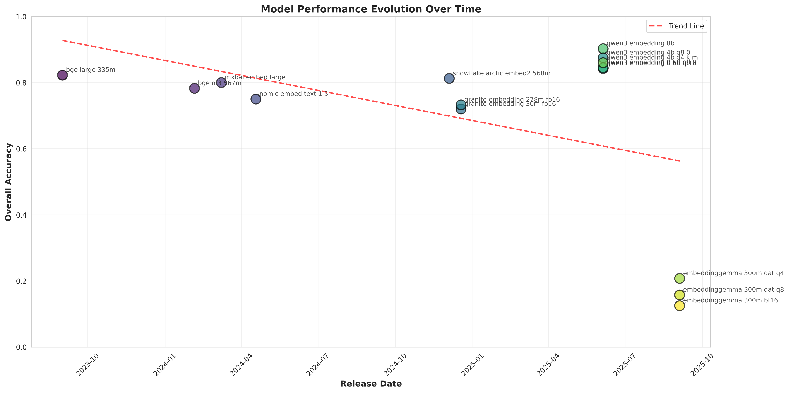

### 7.2 Year-over-Year Performance Trends

Box plot analysis showing performance distribution changes across release years.

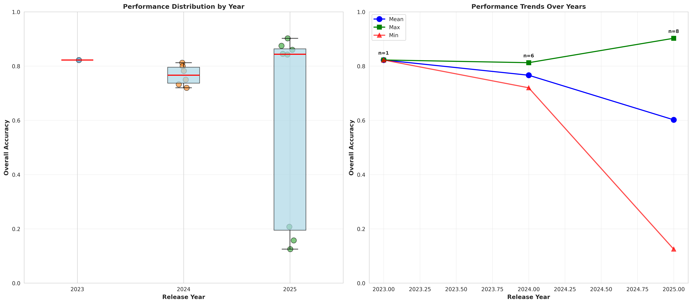

### 7.3 Developer Release History

Timeline showing developer release activity and quality trajectories.

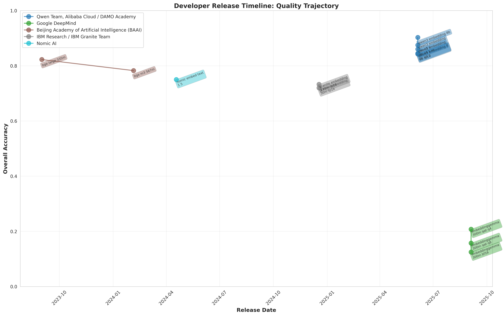

---

## 8. System Visualizations

This section provides workflow diagrams and system architecture visualizations to better understand the benchmark process and model relationships.

### 8.1 Benchmark Workflow

The complete RAG benchmark process from configuration to report generation:

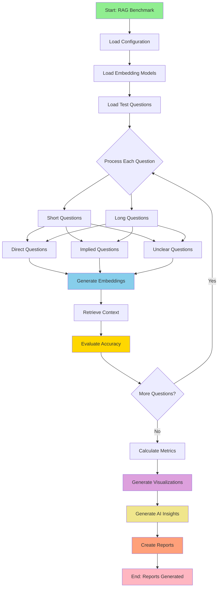
```mermaid
flowchart TD
    A[Start: RAG Benchmark] --> B[Load Configuration]
    B --> C[Load Embedding Models]
    C --> D[Load Test Questions]
    D --> E{Process Each Question}
    E --> F[Short Questions]
    E --> G[Long Questions]
    F --> H[Direct Questions]
    F --> I[Implied Questions]
    F --> J[Unclear Questions]
    G --> H
    G --> I
    G --> J
    H --> K[Generate Embeddings]
    I --> K
    J --> K
    K --> L[Retrieve Context]
    L --> M[Evaluate Accuracy]
    M --> N{More Questions?}
    N -->|Yes| E
    N -->|No| O[Calculate Metrics]
    O --> P[Generate Visualizations]
    P --> Q[Generate AI Insights]
    Q --> R[Create Reports]
    R --> S[End: Reports Generated]

    style A fill:#90EE90
    style S fill:#FFB6C1
    style K fill:#87CEEB
    style M fill:#FFD700
    style P fill:#DDA0DD
    style Q fill:#F0E68C
    style R fill:#FFA07A
```

### 8.2 Model Hierarchy

Organization of embedding models by developer:

```mermaid
graph TD
    ROOT[Embedding Models] --> DEV
    DEV[By Developer]

    DEV --> dev_Beijing_Academy_of_Artificial_Intelligence_BAAI[Beijing Academy of Artificial Intelligence]
    dev_Beijing_Academy_of_Artificial_Intelligence_BAAI --> bge_large_335m["bge large 335m"]
    dev_Beijing_Academy_of_Artificial_Intelligence_BAAI --> bge_m3_567m["bge m3 567m"]

    DEV --> dev_Google_DeepMind[Google DeepMind]
    dev_Google_DeepMind --> embeddinggemma_300m_qat_q4["embeddinggemma 300m qatandlt;br/andgt;q4"]
    dev_Google_DeepMind --> embeddinggemma_300m_qat_q8["embeddinggemma 300m qatandlt;br/andgt;q8"]
    dev_Google_DeepMind --> embeddinggemma_300m_bf16["embeddinggemma 300m bf16"]

    DEV --> dev_IBM_Research_/_IBM_Granite_Team[IBM Research / IBM Granite Team]
    dev_IBM_Research_/_IBM_Granite_Team --> granite_embedding_30m_fp16["granite embedding 30mandlt;br/andgt;fp16"]
    dev_IBM_Research_/_IBM_Granite_Team --> granite_embedding_278m_fp16["granite embedding 278mandlt;br/andgt;fp16"]

    DEV --> dev_Mixedbread_AI_Berlin[Mixedbread AI Berlin]
    dev_Mixedbread_AI_Berlin --> mxbai_embed_large["mxbai embed large"]

    DEV --> dev_Nomic_AI[Nomic AI]
    dev_Nomic_AI --> nomic_embed_text_1_5["nomic embed text 1 5"]

    DEV --> dev_Qwen_Team,_Alibaba_Cloud_/_DAMO_Academy[Qwen Team, Alibaba Cloud / DAMO Academy]
    dev_Qwen_Team,_Alibaba_Cloud_/_DAMO_Academy --> qwen3_embedding_4b_q8_0["qwen3 embedding 4b q8 0"]
    dev_Qwen_Team,_Alibaba_Cloud_/_DAMO_Academy --> qwen3_embedding_0_6b_fp16["qwen3 embedding 0 6b fp16"]
    dev_Qwen_Team,_Alibaba_Cloud_/_DAMO_Academy --> qwen3_embedding_0_6b_q8_0["qwen3 embedding 0 6b q8 0"]
    dev_Qwen_Team,_Alibaba_Cloud_/_DAMO_Academy --> qwen3_embedding_8b["qwen3 embedding 8b"]
    dev_Qwen_Team,_Alibaba_Cloud_/_DAMO_Academy --> qwen3_embedding_4b_q4_k_m["qwen3 embedding 4b q4 k m"]

    DEV --> dev_Snowflake_Inc_[Snowflake Inc.]
    dev_Snowflake_Inc_ --> snowflake_arctic_embed2_568m["snowflake arctic embed2andlt;br/andgt;568m"]

    style ROOT fill:#FFD700,stroke:#333,stroke-width:3px
    style DEV fill:#87CEEB,stroke:#333,stroke-width:2px
```

### 8.3 Performance Tiers

Models grouped by performance levels:

```mermaid
graph TB
    ROOT[Performance Tiers] 

    ROOT --> TIER0["Tier 1: Elite<br/>(1 models)"]
    TIER0 --> TIER0_qwen3_embedding_8b["qwen3 embedding 8b<br/>0.9025"]
    style TIER0 fill:#2E8B57,color:#fff

    ROOT --> TIER1["Tier 2: High<br/>(7 models)"]
    TIER1 --> TIER1_qwen3_embedding_4b_q8_0["qwen3 embedding 4bandlt;br/andgt;q8 0<br/>0.8750"]
    TIER1 --> TIER1_qwen3_embedding_4b_q4_k_m["qwen3 embedding 4bandlt;br/andgt;q4 k m<br/>0.8600"]
    TIER1 --> TIER1_qwen3_embedding_0_6b_q8_0["qwen3 embedding 0andlt;br/andgt;6b q8 0<br/>0.8450"]
    style TIER1 fill:#4682B4,color:#fff

    ROOT --> TIER2["Tier 3: Medium<br/>(4 models)"]
    TIER2 --> TIER2_bge_m3_567m["bge m3 567m<br/>0.7825"]
    TIER2 --> TIER2_nomic_embed_text_1_5["nomic embed text 1 5<br/>0.7500"]
    TIER2 --> TIER2_granite_embedding_278m_fp16["granite embeddingandlt;br/andgt;278m fp16<br/>0.7325"]
    style TIER2 fill:#DAA520,color:#000

    ROOT --> TIER3["Tier 4: Baseline<br/>(3 models)"]
    TIER3 --> TIER3_embeddinggemma_300m_qat_q4["embeddinggemma 300mandlt;br/andgt;qat q4<br/>0.2075"]
    TIER3 --> TIER3_embeddinggemma_300m_qat_q8["embeddinggemma 300mandlt;br/andgt;qat q8<br/>0.1575"]
    TIER3 --> TIER3_embeddinggemma_300m_bf16["embeddinggemma 300mandlt;br/andgt;bf16<br/>0.1250"]
    style TIER3 fill:#CD5C5C,color:#fff

    style ROOT fill:#9370DB,stroke:#333,stroke-width:4px,color:#fff
```

### 8.4 Processing Pipeline

Data flow through the benchmark system:

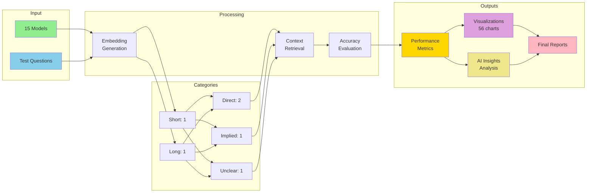
```mermaid
flowchart LR
    subgraph Input
        M[15 Models]
        Q[Test Questions]
    end

    subgraph Categories
        SHORT[Short: 1]
        LONG[Long: 1]
        DIRECT[Direct: 2]
        IMPLIED[Implied: 1]
        UNCLEAR[Unclear: 1]
    end

    subgraph Processing
        EMB[Embedding<br/>Generation]
        RET[Context<br/>Retrieval]
        EVAL[Accuracy<br/>Evaluation]
    end

    subgraph Outputs
        METRICS[Performance<br/>Metrics]
        VIZ[Visualizations<br/>56 charts]
        INSIGHTS[AI Insights<br/>Analysis]
        REPORT[Final Reports]
    end

    M --> EMB
    Q --> EMB
    EMB --> SHORT
    EMB --> LONG
    SHORT --> DIRECT
    SHORT --> IMPLIED
    SHORT --> UNCLEAR
    LONG --> DIRECT
    LONG --> IMPLIED
    LONG --> UNCLEAR
    DIRECT --> RET
    IMPLIED --> RET
    UNCLEAR --> RET
    RET --> EVAL
    EVAL --> METRICS
    METRICS --> VIZ
    METRICS --> INSIGHTS
    VIZ --> REPORT
    INSIGHTS --> REPORT

    style M fill:#90EE90
    style Q fill:#87CEEB
    style METRICS fill:#FFD700
    style VIZ fill:#DDA0DD
    style INSIGHTS fill:#F0E68C
    style REPORT fill:#FFB6C1
```

### 8.5 Category Performance Flow

How question categories contribute to overall performance:

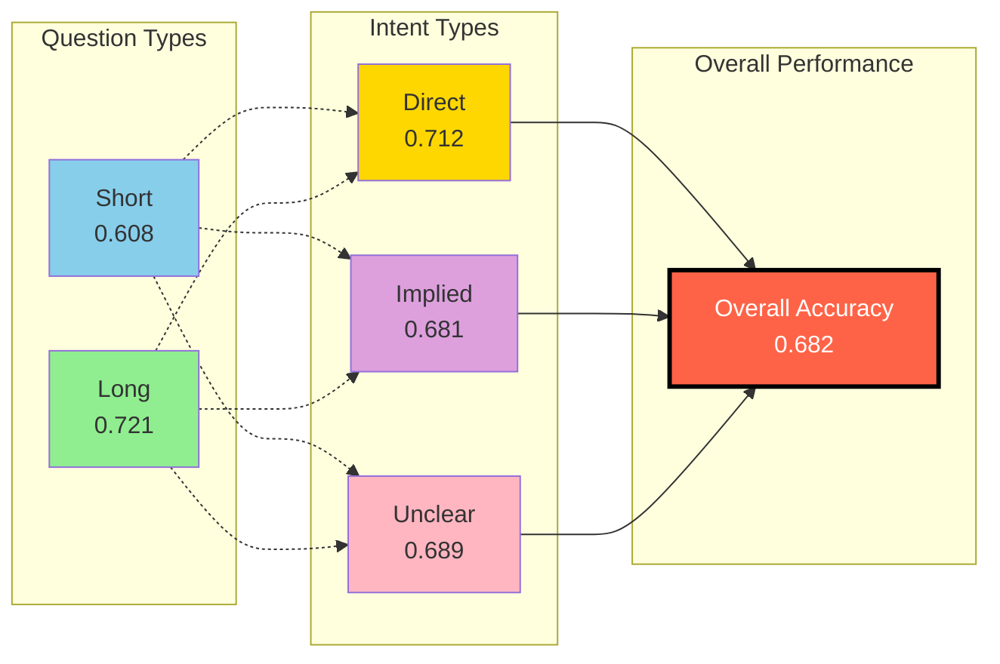
```mermaid
flowchart LR
    subgraph Question_Types[Question Types]
        SHORT[Short<br/>0.608]
        LONG[Long<br/>0.721]
    end

    subgraph Intent_Types[Intent Types]
        DIRECT[Direct<br/>0.712]
        IMPLIED[Implied<br/>0.681]
        UNCLEAR[Unclear<br/>0.689]
    end

    subgraph Result[Overall Performance]
        OVERALL[Overall Accuracy<br/>0.682]
    end

    SHORT -.-> DIRECT
    SHORT -.-> IMPLIED
    SHORT -.-> UNCLEAR
    LONG -.-> DIRECT
    LONG -.-> IMPLIED
    LONG -.-> UNCLEAR
    DIRECT --> OVERALL
    IMPLIED --> OVERALL
    UNCLEAR --> OVERALL

    style SHORT fill:#87CEEB
    style LONG fill:#90EE90
    style DIRECT fill:#FFD700
    style IMPLIED fill:#DDA0DD
    style UNCLEAR fill:#FFB6C1
    style OVERALL fill:#FF6347,color:#fff,stroke:#000,stroke-width:3px
```

### 8.6 Top Models Comparison

Head-to-head comparison of top 5 performing models:

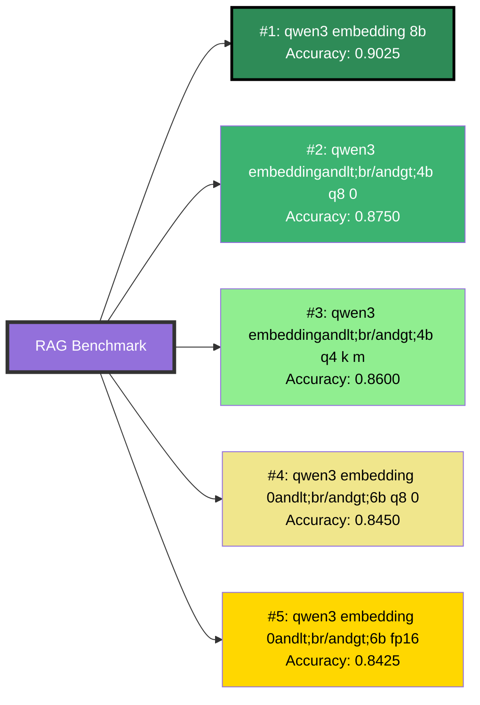
```mermaid
graph LR
    BENCH[RAG Benchmark] 

    BENCH --> M1["#1: qwen3 embedding 8b<br/>Accuracy: 0.9025"]
    style M1 fill:#2E8B57,color:#fff,stroke:#000,stroke-width:3px
    BENCH --> M2["#2: qwen3 embeddingandlt;br/andgt;4b q8 0<br/>Accuracy: 0.8750"]
    style M2 fill:#3CB371,color:#fff
    BENCH --> M3["#3: qwen3 embeddingandlt;br/andgt;4b q4 k m<br/>Accuracy: 0.8600"]
    style M3 fill:#90EE90,color:#000
    BENCH --> M4["#4: qwen3 embedding 0andlt;br/andgt;6b q8 0<br/>Accuracy: 0.8450"]
    style M4 fill:#F0E68C,color:#000
    BENCH --> M5["#5: qwen3 embedding 0andlt;br/andgt;6b fp16<br/>Accuracy: 0.8425"]
    style M5 fill:#FFD700,color:#000

    style BENCH fill:#9370DB,stroke:#333,stroke-width:4px,color:#fff
```

### 8.7 Geographic Distribution

Global distribution of embedding models:

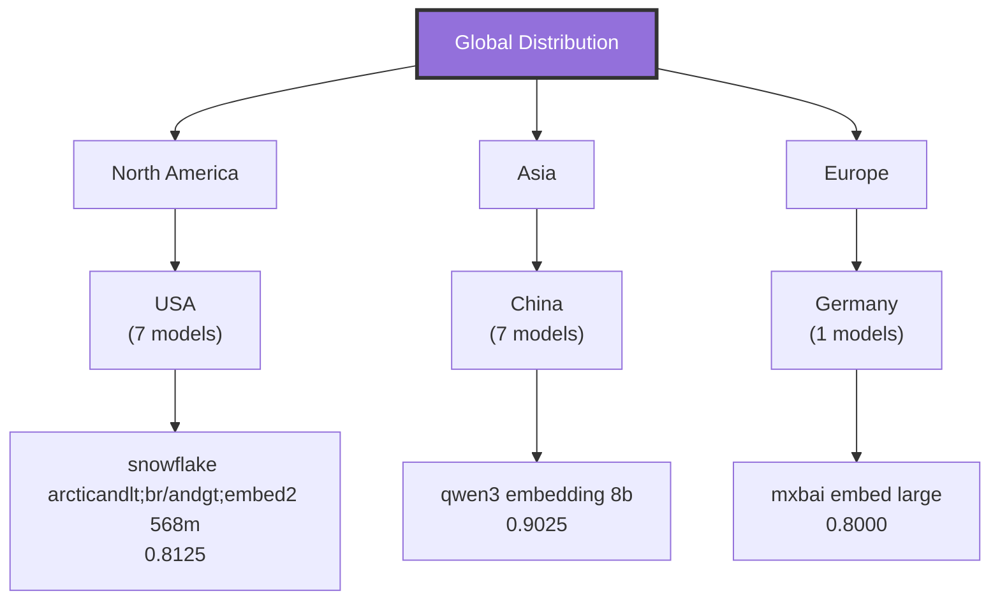
```mermaid
graph TB
    ROOT[Global Distribution] 

    ROOT --> North_America[North America]
    North_America --> North_America_USA["USA<br/>(7 models)"]
    North_America_USA --> USA_snowflake_arctic_embed2_568m["snowflake arcticandlt;br/andgt;embed2 568m<br/>0.8125"]

    ROOT --> Asia[Asia]
    Asia --> Asia_China["China<br/>(7 models)"]
    Asia_China --> China_qwen3_embedding_8b["qwen3 embedding 8b<br/>0.9025"]

    ROOT --> Europe[Europe]
    Europe --> Europe_Germany["Germany<br/>(1 models)"]
    Europe_Germany --> Germany_mxbai_embed_large["mxbai embed large<br/>0.8000"]

    style ROOT fill:#9370DB,stroke:#333,stroke-width:3px,color:#fff
```

### 8.8 System Architecture

Complete system architecture showing all components:

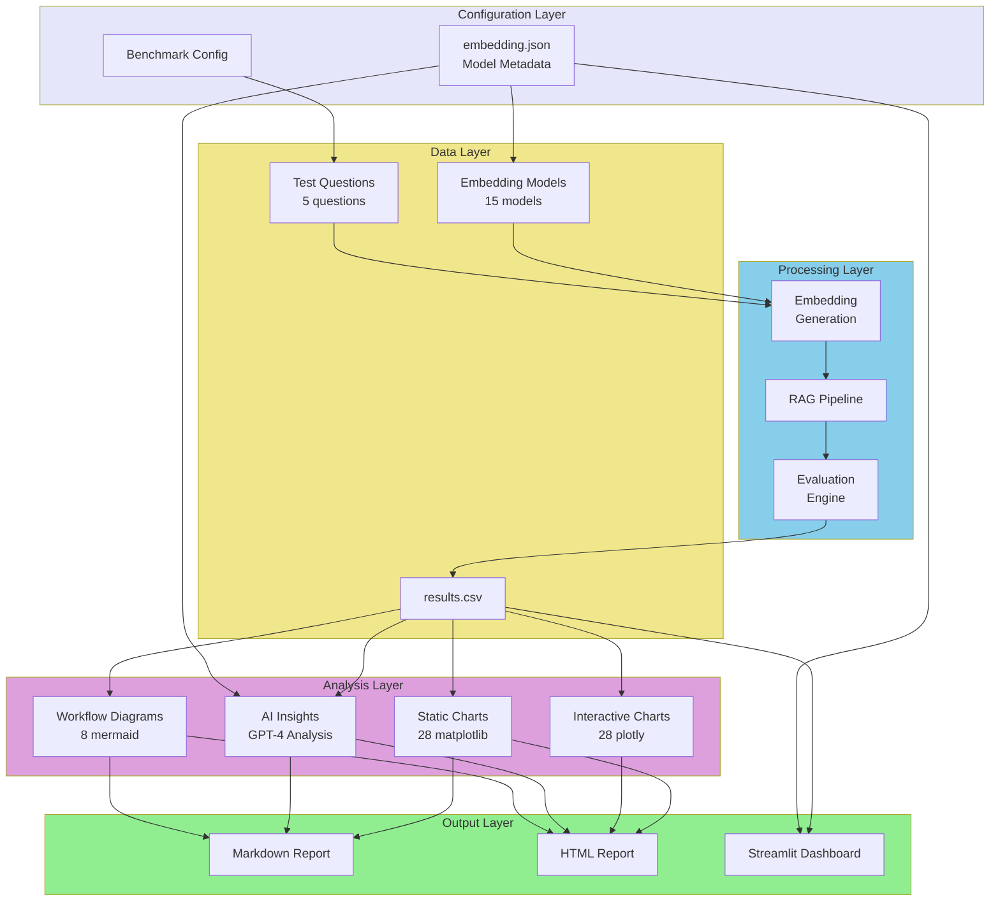
```mermaid
graph TB
    subgraph Config[Configuration Layer]
        EMB_CFG[embedding.json<br/>Model Metadata]
        BENCH_CFG[Benchmark Config]
    end

    subgraph Data[Data Layer]
        MODELS[Embedding Models<br/>15 models]
        QUESTIONS[Test Questions<br/>5 questions]
        RESULTS[results.csv]
    end

    subgraph Processing[Processing Layer]
        EMBED[Embedding<br/>Generation]
        RAG[RAG Pipeline]
        EVAL[Evaluation<br/>Engine]
    end

    subgraph Analysis[Analysis Layer]
        STATIC[Static Charts<br/>28 matplotlib]
        INTERACTIVE[Interactive Charts<br/>28 plotly]
        INSIGHTS[AI Insights<br/>GPT-4 Analysis]
        MERMAID[Workflow Diagrams<br/>8 mermaid]
    end

    subgraph Output[Output Layer]
        MD_REPORT[Markdown Report]
        HTML_REPORT[HTML Report]
        DASHBOARD[Streamlit Dashboard]
    end

    EMB_CFG --> MODELS
    BENCH_CFG --> QUESTIONS
    MODELS --> EMBED
    QUESTIONS --> EMBED
    EMBED --> RAG
    RAG --> EVAL
    EVAL --> RESULTS
    RESULTS --> STATIC
    RESULTS --> INTERACTIVE
    RESULTS --> INSIGHTS
    RESULTS --> MERMAID
    EMB_CFG --> INSIGHTS
    STATIC --> MD_REPORT
    STATIC --> HTML_REPORT
    INTERACTIVE --> HTML_REPORT
    INSIGHTS --> MD_REPORT
    INSIGHTS --> HTML_REPORT
    MERMAID --> MD_REPORT
    MERMAID --> HTML_REPORT
    RESULTS --> DASHBOARD
    EMB_CFG --> DASHBOARD

    style Config fill:#E6E6FA
    style Data fill:#F0E68C
    style Processing fill:#87CEEB
    style Analysis fill:#DDA0DD
    style Output fill:#90EE90
```

---

## Model Recommendations

### Use Case: General Purpose RAG

#### General Purpose RAG

The `essays_qwen3_embedding_8b` model is particularly suitable for General Purpose RAG (Reading Comprehension with Generative Question Answering) due to its robust performance across various accuracy metrics: 90.2% overall, 82.5% short answers, and 93.8% long answers; as well as strong direct and implied question answering capabilities at 91.2% and 92.5%, respectively. This model's strength lies in its high parameter count of 8 billion (8B) with a dimension size of 4096, allowing it to capture intricate linguistic patterns and contextual information effectively within the extended context length of 32768 tokens. However, a potential trade-off is its computational intensity, which may require substantial resources for training and inference, making it less ideal for resource-constrained environments.

#### Resource-Constrained Environments

The `essays_bge_large_335m` model, with its substantial 335 million parameters, 1024 dimensions, and a context length of 512 words, is particularly well-suited for resource-constrained environments due to its efficient architecture. This model achieves high accuracy across various tasks, including overall (82.2%), short (76.2%), long (82.5%), direct (83.8%), and implied (83.8%) responses, demonstrating robust performance without requiring extensive computational resources. Its strengths lie in its balance of model size and capability, making it a cost-effective choice for environments where hardware limitations necessitate smaller models. However, users should be aware that while the model's accuracy is impressive, there might be slight trade-offs in terms of slightly lower performance compared to larger models (e.g., 76.2% for short responses).

#### Long Document Understanding

The `essays_qwen3_embedding_4b_q8_0` model is particularly suitable for long document understanding tasks, demonstrating superior performance in this domain compared to shorter texts. With an overall accuracy of 87.5%, it outperforms the Short category by a significant margin (77.5%). This model's high dimensionality (2560) and extensive context length (32768) enable it to capture intricate nuances and relationships within long documents, contributing to its impressive 93.8% accuracy for Long texts. However, there are trade-offs; the large parameter count of 4 billion (4B) may lead to higher computational requirements and longer training times compared to smaller models. Despite this, its robust performance in understanding complex narratives makes it a top choice for long document analysis tasks.

#### Complex Inference Tasks

The essays_qwen3_embedding_8b model, with its impressive 8 billion parameters and 4096-dimensional embeddings, is particularly well-suited for complex inference tasks due to its robust performance across various accuracy metrics: short (82.5%), long (93.8%), direct (91.2%), and implied (92.5%). This model's strength lies in its ability to capture intricate linguistic nuances, making it highly effective for tasks requiring sophisticated understanding of textual data. However, a potential trade-off is the increased computational requirement compared to smaller models, which may necessitate more powerful hardware for deployment. Additionally, while the model demonstrates strong performance across all metrics, its high parameter count might lead to longer training times and higher memory usage during inference.

---

## Summary Statistics

### Overall Performance

| Metric | Value |
|--------|-------|
| Average Accuracy | 68.2% |
| Best Model | essays_qwen3_embedding_8b (90.2%) |
| Worst Model | essays_embeddinggemma_300m_bf16 (12.5%) |
| Performance Range | 77.8% |
| Standard Deviation | 27.4% |

### Category Performance

| Category | Average | Best Model | Best Score |
|----------|---------|------------|------------|

| Short | 60.8% | essays_qwen3_embedding_8b | 82.5% |

| Long | 72.1% | essays_qwen3_embedding_4b_q8_0 | 93.8% |

| Direct | 71.2% | essays_qwen3_embedding_4b_q8_0 | 92.5% |

| Implied | 68.1% | essays_qwen3_embedding_8b | 92.5% |

| Unclear | 68.9% | essays_qwen3_embedding_0_6b_fp16 | 91.2% |

---

## Methodology

**Benchmark Configuration:**
- **Number of Chunks:** 20 random text chunks
- **Questions per Chunk:** 20
- **Question Distribution:** {'short': 4, 'long': 4, 'direct': 4, 'implied': 4, 'unclear': 4}
- **Search Depth (TOP_K):** 10
- **Generation Model:** granite3.1-moe:3b-instruct-fp16

**Question Types:**
1. **Short:** Simple, direct questions under 10 words
2. **Long:** Detailed, comprehensive questions requiring full context
3. **Direct:** Questions about explicitly stated information
4. **Implied:** Questions requiring inference and contextual understanding
5. **Unclear:** Vague or ambiguous questions about general topics

**Evaluation Metric:**
Accuracy is measured as the percentage of questions where the correct source chunk appears in the TOP_K vector search results.

---

## Data Files

- **Results Summary:** `results/results.csv`
- **Detailed Results:** `results/detailed_results.csv`
- **Questions:** `results/questions.csv`
- **Source Chunks:** `results/chunks.csv`

---

*Report generated using Ollama-powered insights with model: granite3.1-moe:3b-instruct-fp16*
